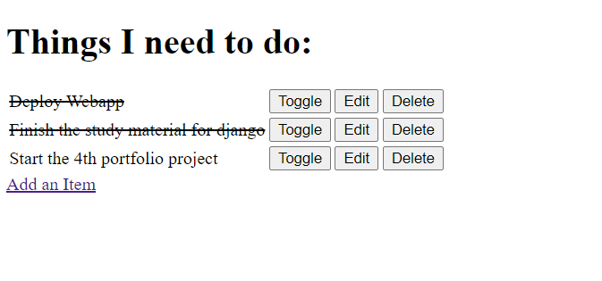
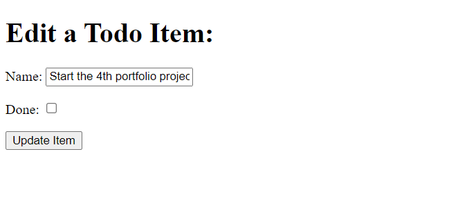

# Django Todo List

A mini project introducing the Django framework, as part of Code Institute's Diploma in Full Stack Software Development course material. 

[Link to deployed project](https://ah-django-todo-app.herokuapp.com//)

